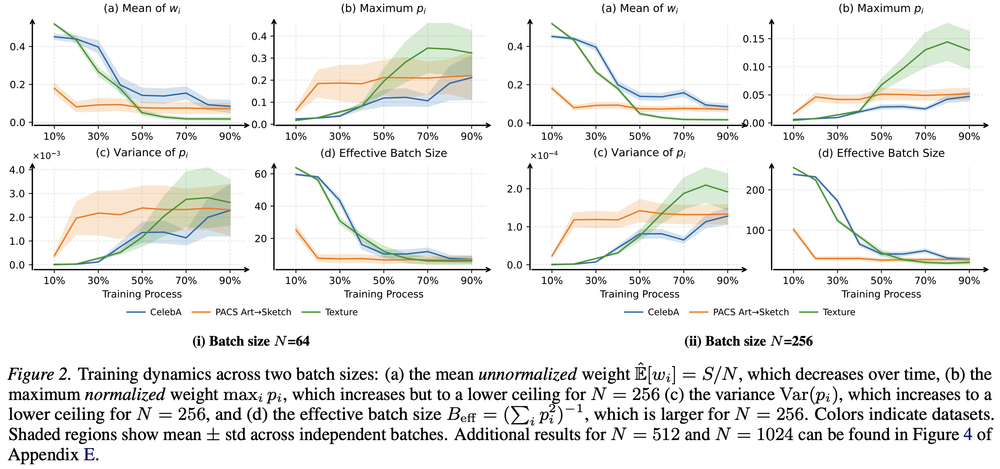

# On the Difficulty of Learning a Meta-network for Training Data Selection

This repository contains the official code for the paper:

**On the Difficulty of Learning a Meta-network for Training Data Selection**

Paper: [https://arxiv.org/pdf/2606.00571](https://arxiv.org/pdf/2606.00571)



## Installation

Please create the environment using the provided `environment.yml` file:

```bash
conda env create -f environment.yml
conda activate mts
```

## Usage

### Step 1: Prepare Data

Please prepare the required datasets following the instructions in the `data/` folder.

### Step 2: Offline Feature Computation

Please compute the offline features following the instructions and scripts in the `features/` folder.

### Step 3: Model Training

Please refer to `scripts.sh` for training scripts.

An example command for training on WaterBirds is shown below:

```bash
export MASTER_PORT=25000

# WaterBirds
CUDA_VISIBLE_DEVICES=0,1,2,3 torchrun --nproc_per_node=4 --master_port=$MASTER_PORT github/main_parallel.py \
--batch_size 1024 \
--wdb_name 'WB' \
--max_epoch 450 \
--meta_lr 1e-3 \
--meta_weight_decay 1e-4 \
--meta_optimizer 'AdamW' \
--meta_scheduler \
--weight_decay 1e-4 \
--loss_norm 0 \
--dataset 'waterbirds2' \
--syn \
--syn_file 'instructpix2pix_filtered_&_sampled_839' \
--class_weights \
--feature 'CLS_nearest_real_cos, class, CLS_center_cos, group, SD_real_center, SD_syn_center, SD_real_3nearest, SD_syn_3nearest, SD_weighted_knn_acc, SD_distance_median, pre_gradient, pre_logit, pre_forgetting' \
--pre_feature_file 'scores_from_pretrained_model' \
--lr 0.001 \
--test_interval 15 \
--model_id resnet50 \
--pretrained \
--val_batch_size 128 \
--scheduler_epoch \
--weight_store_interval 50 \
--feature_norm 'batch_norm' \
--meta_net_num_layers 2 \
--seed 1 \
--product_eps 1e-2 \
--pseudo_lr 0.01 \
--pseudo_eval \
--original_cls_training \
--training_bz_for_selector 1024 \
--different_batch_across_gpu
```

## Acknowledgements

This codebase builds upon and benefits from the following repositories:

- [ALIA](https://github.com/lisadunlap/ALIA)
- [NotJustPrettyPictures](https://github.com/YuanJianhao508/NotJustPrettyPictures)
- [Meta-Weight-Net_Code-Optimization](https://github.com/ShiYunyi/Meta-Weight-Net_Code-Optimization)

We sincerely thank the authors for making their code publicly available.

## Contact

If you have any questions, please feel free to contact:

**Zilin Du**  zilin003@e.ntu.edu.sg

## Citation

If you find this repository useful, please consider citing our paper:

```bibtex
@article{du2026difficulty,
  title={On the Difficulty of Learning a Meta-network for Training Data Selection},
  author={Du, Zilin and Zhao, Junqi and Li, Boyang Albert},
  journal={arXiv preprint arXiv:2606.00571},
  year={2026}
}
```
